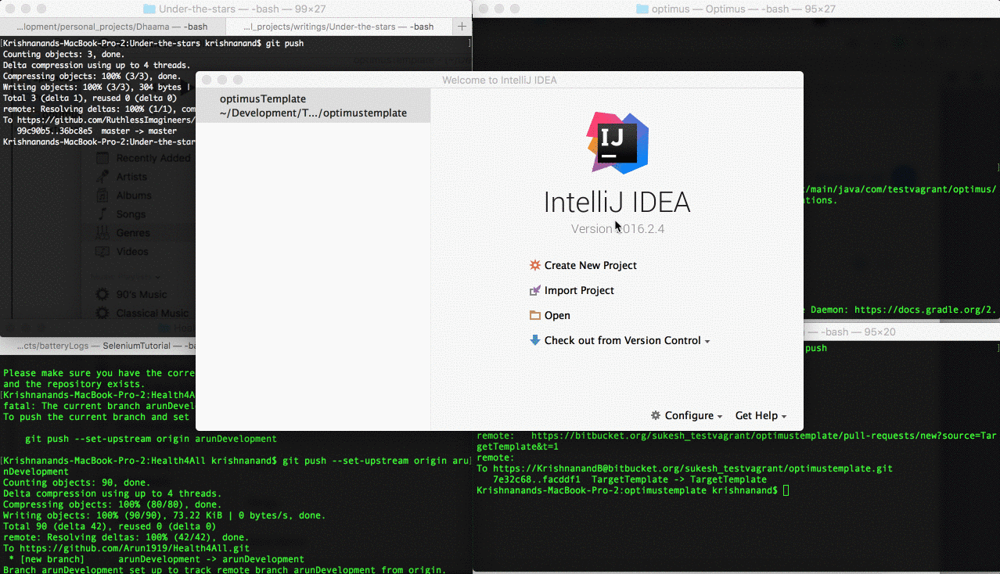
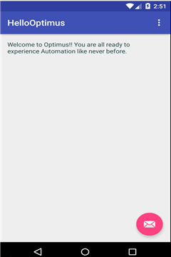
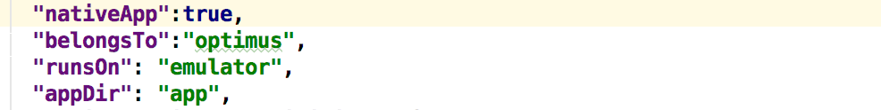

# Optimus Template  [](https://badge.fury.io/js/optimus-cli) [](https://gitter.im/optimus_support/optimus)

Optimus Template is the native framework for Optimus, designed to help you
to get started with your tests in the swiftest time possible.

#### First things first
Before you get your hands on Optimus Template, please make sure your system meets the desired
[prerequisites](Prerequisites.md)

## Getting started with Optimus Template
You can either fork Optimus Template repository or download the bundle from [here](https://github.com/testvagrant/optimusTemplate/archive/master.zip).

If you have forked Optimus Template, you can clone from your fork to your machine using

```bash
git clone <Enter git clone link here>
```

Use your favourite IDE for building the project, however we love
IntelliJ though.



Optimus Template is inherently a Page Object Model.
If you are new to this design pattern, we strongly recommend you to read about [Page Object Model](http://martinfowler.com/bliki/PageObject.html),
before you continue reading further.

#### Template Structure
If your download flavour is of type BDD, you will find that Optimus Template is
structured in the lines of Cucumber with below structure

``` java
optimustemplate/
+-- build.gradle
+-- app //Store Application Under Test for Android or Ios platforms.
    +-- hellooptimus.apk
+-- src/test
    +-- java
    ¦   +-- pages 
    ¦        +-- BasePage.java 
    ¦   +-- steps 
    ¦       +-- BaseSteps.java
    ¦       +-- StartingSteps.java
    ¦   +-- utils 
            +-- OptimusImpl.java
    +-- resources
    ¦   +-- features
    ¦   ¦  +-- interApp.feature
    ¦   ¦  +-- singleApp.feature
    +-- interApp.json
    +-- singleApp.json
```

The template comes with few pre-defined classes. You can harness
the power of Optimus through them.

   <pre>
    <b>BasePage.java</b>: Any page you create can extend BasePage to perform most of the
    actions required to test your functionality, without having to reinvent the wheel.
    <b>BaseSteps.java</b>: Any Step definition can extend BaseSteps.
    <b>StartingSteps.java</b>: For Optimus Template use only.
   </pre>

### Your First Test
Writing tests in Optimus is no different than the tests you write everyday,
except that it does most of the heavy lifting, helping you to focus entirely on the test, 
thus the philosophy of Optimus

> Focus On Functionality

#### Building Test Feed
If there is anything at your disposal to tame the mighty Optimus,
then its your [TestFeed](#testFeed). Let us build a simple test feed similar to
the one you will find in your project `singleApp.json`

Under `resources` folder create a new json file called `helloOptimus.json`. You can copy below content in your newly created test feed.

```json
{
  "executionDetails": {
    "appium_js_path": "/usr/local/bin/appium",
    "appium_node_path": "/usr/local/bin/node"
  },
  "testFeed":[
    {
      "belongsTo":"optimus",
      "runsOn": "emulator",
      "appDir": "app",
      "nativeApp":true,
      "optimusDesiredCapabilities": {
        "appiumServerCapabilities": {
          "app": "hellooptimus.apk",
          "platformName": "Android"
        },
        "androidOnlyCapabilities": {
          "appActivity": "com.testvagrant.hellooptimus.MainActivity",
          "appPackage": "com.testvagrant.hellooptimus",
          "avdLaunchTimeout": 300000,
          "useKeystore": false
        }
      }
    }
  ]
}
```

Optimus would generally read this test feed as 
<pre>
Create a driver which <b>belongsTo</b> <b>optimus</b> for an app <b>hellooptimus</b> running on
<b>emulator</b> on <b>Android</b> platform.
</pre>

You can create number of variations to this test feed matching your functionality.

### Feature file
Under package `features` create a new feature `HelloOptimus.feature`.

``` gherkin
Feature: Say Hello to Optimus

  @helloOptimus
  Scenario: Hello Optimus
    Given I have optimus hello application
    When I open it on either emulator, simulator or device on any platform
    Then I should be able to say a hello to optimus
```

Go ahead and create a step definition file for above feature under `steps` package.

``` java 
public class HelloOptimusSteps extends BaseSteps{
    @Given("^I have optimus hello application$")
    public void iHaveOptimusHelloApplication() throws Throwable {
        getDriverInstanceFor("optimus");
    }

    @When("^I open it on either emulator, simulator or device on any platform$")
    public void iOpenItOnEitherEmulatorSimulatorOrDeviceOnAnyPlatform() throws Throwable {

    }

    @Then("^I should be able to say a hello to optimus$")
    public void iShouldBeAbleToSayAHelloToOptimus() throws Throwable {

    }
}
```
To access the webDriver for your application, all you would need is `getDriverInstanceFor(<belongsTo>)`. This is a powerful approach when you do interApp testing.

Now you are all set to run your first test. Lets get a bit geeky here.
Bootup your favourite emulator.
Open your terminal and navigate to your project folder
and try below command.

```bash
./gradlew runFragmentation -DtestFeed="helloOptimus" -Dtags=@helloOptimus
```

or

```bash
./gradlew runDistribution -DtestFeed="helloOptimus" -Dtags=@helloOptimus

```

In case you have a gradle distribution on local you can run below commands

```bash
gradle runFragmentation -DtestFeed="helloOptimus" -Dtags=@helloOptimus
```
 or
 
```bash
gradle runDistribution -DtestFeed="helloOptimus" -Dtags=@helloOptimus
```
 
After all the initial setup process you will be able to see `optimushello` app appear on your emulator screen



Kudos for your first successful test with Optimus. Now that you have reached here, let us understand the basic features and building blocks of Optimus.


## Features
With Optimus, you will be able to write tests capable of running in below modes without ever having to worry about managing servers or device setup.

    * Distributed Mode
    * Fragmentation Mode

If this might sound obvious like any other framework, with Optimus you will be able to test

    * Single App
    * Inter App
    * Mobile Web

## Test Feed <a id="testFeed"></a>
Optimus is extremely powerful yet fun to work with
once you understand what to feed your tests, for a seamless automation experience.
Test Feed, typically a JSON format, will let you control all your tests from a single source of truth,
giving you complete control of your tests execution. Any Test Feed will contain following sections

    * Common Attributes
    * Appium Server Capabilities
    * Android or iOS Only Capabilities


#### Common Attributes
These attributes are set across all tests running on a common test feed.

   <pre>
        <b>Native App</b>: Sets the context for your test to run on a native app or mobile web
        <b>Belongs To</b>: Assigns the test to a particular application.
        <b>Runs On</b>: Assigns the test to user specific device. You can choose to run your tests either on device or emulator.
        <b>Application Directory</b>: Specifies the folder name where the application under test is placed.
       </pre>

##### Example




#### Appium Server Capabilities 
Optimus by default supports all the capabilities that Appium provides, which you can refer from [here](https://github.com/appium/appium/blob/master/docs/en/writing-running-appium/caps.md).
Since Optimus inherently possesses immense intelligence to handle all capabilities by default without troubling you much,
all it needs are a couple of capabilities.


  <pre>
   <b>App</b>: Name of application to test. Optimus will look for this app under the “appDir” folder specified as part of common attributes.
   <b>Platform Name</b>: Specifies the platform to run the application on.
   </pre>

##### Example 


These capabilities will be sufficient enough to run most of the tests if not all.
Under which circumstances you may choose to provide additional
[Appium Server Capabilities](https://github.com/appium/appium/blob/master/docs/en/writing-running-appium/caps.md).

#### Android only Capabilities 
Optimus supports all android related capabilities as specified [here](https://github.com/appium/appium/blob/master/docs/en/writing-running-appium/caps.md).
Optimus does not enforce any of these capabilities to be set for running your tests.
However you are free to provide as many capabilities as you may need.

#### Supported Platforms
    * Android - SDK Emulators, Genymotion Emulators and all devices
    * IOS - Simulators and Devices

With this fair amount of idea, you are now all set to start your Automation Journey with Optimus. If you have any specific queries reach 
out to us at optimus@testvagrant.com


